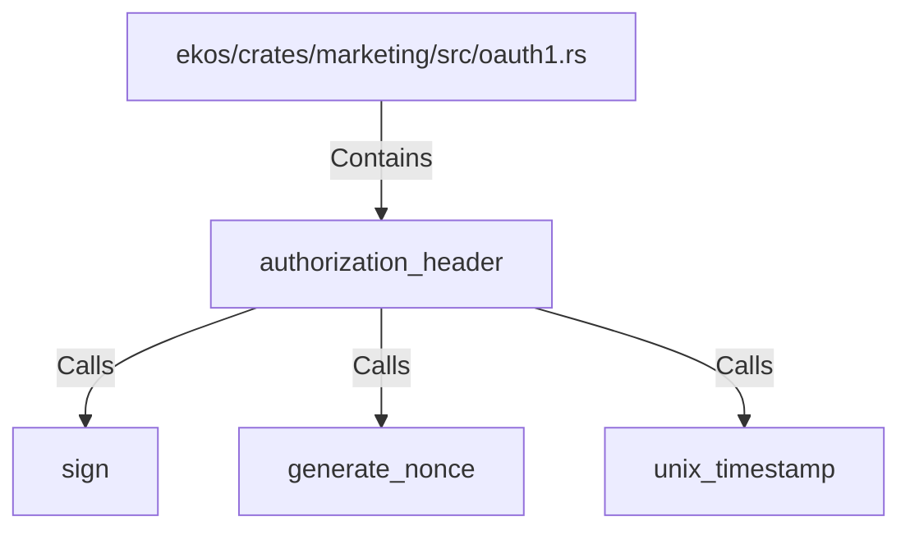

# authorization_header (RustSymbol)

## Properties

| Key | Value |
|---|---|
| `kind` | function |

## Relationships

### Calls

- → sign (`d047fc97-d007-5911-8fb5-7f43a79a6b03`)
- → generate_nonce (`c15fbd69-b60d-5004-b305-6a836bf18ebd`)
- → unix_timestamp (`c3d5f345-a134-51fe-84fa-e2d08acd4eaa`)

### Contains

- ← ekos/crates/marketing/src/oauth1.rs (`d9547f96-f031-5a9d-875d-5912db96b474`)

## Diagram

## Evidence

_No evidence cited._
