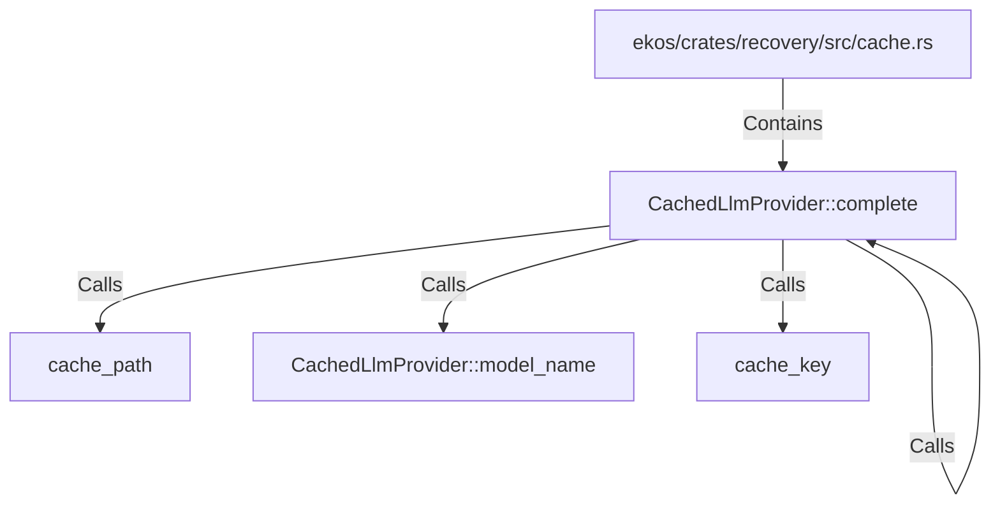

# CachedLlmProvider::complete (RustSymbol)

## Properties

| Key | Value |
|---|---|
| `kind` | method |

## Relationships

### Calls

- → cache_path (`220594e1-9d9d-53fc-be8d-24c63db12040`)
- → CachedLlmProvider::model_name (`2d44742b-555e-5c97-898b-b162cdb09a8d`)
- → cache_key (`d78c6cd6-1f31-51d0-a15f-292fb28c8614`)
- → CachedLlmProvider::complete (`a17b9530-2256-592a-8e82-2db4eb42b103`)

### Contains

- ← ekos/crates/recovery/src/cache.rs (`0b06681a-4e07-5e02-a8d6-433ccf4aadc4`)

## Diagram

## Evidence

_No evidence cited._
