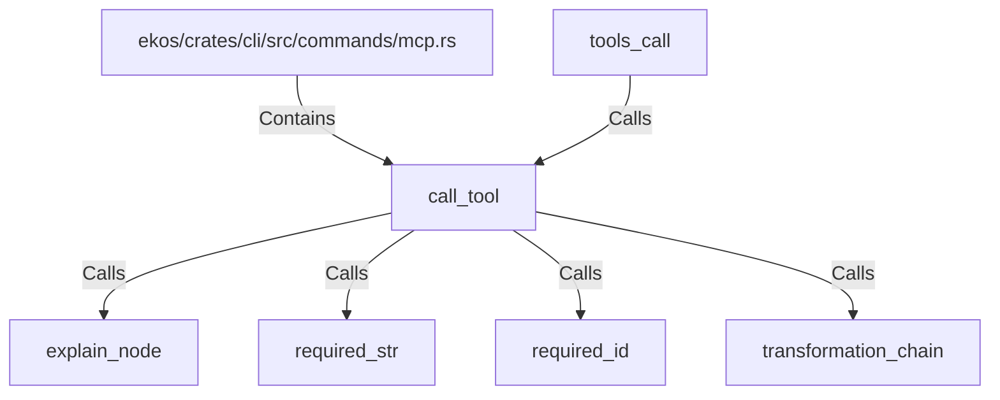

# call_tool (RustSymbol)

## Properties

| Key | Value |
|---|---|
| `kind` | function |

## Relationships

### Calls

- ← tools_call (`52440250-4db8-5d19-8d69-bf98b9de4bd1`)
- → explain_node (`0ebfd1d7-051f-56b4-9112-e5305fb697e3`)
- → required_str (`34ebe6e3-6729-5e55-a0e8-f85730f2eb99`)
- → required_id (`d8d4e4a8-6e9d-5b6d-a699-fe2d97a8071c`)
- → transformation_chain (`fc9051fd-c6d9-5f74-9646-5a2260a739f1`)

### Contains

- ← ekos/crates/cli/src/commands/mcp.rs (`ff76bb73-9285-5295-927c-5cb33a5bbc25`)

## Diagram

## Evidence

_No evidence cited._
