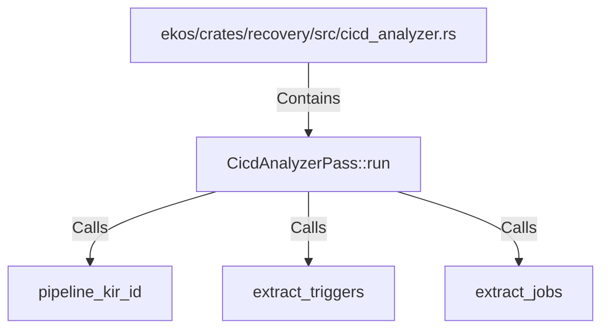

# CicdAnalyzerPass::run (RustSymbol)

## Properties

| Key | Value |
|---|---|
| `kind` | method |

## Relationships

### Calls

- → pipeline_kir_id (`630ff87b-5416-525d-b949-e50b8c6ac173`)
- → extract_triggers (`be0f7bcd-58dd-5d24-8de9-6a2e0f2bc9ec`)
- → extract_jobs (`ffa32f72-651f-58b6-8100-f32b4d3997aa`)

### Contains

- ← ekos/crates/recovery/src/cicd_analyzer.rs (`b6532a21-993c-5d28-8d99-891c30d70063`)

## Diagram

## Evidence

_No evidence cited._
