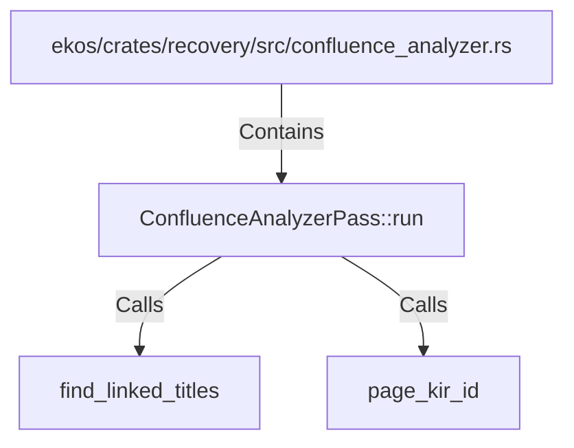

# ConfluenceAnalyzerPass::run (RustSymbol)

## Properties

| Key | Value |
|---|---|
| `kind` | method |

## Relationships

### Calls

- → find_linked_titles (`addac786-8597-5259-8bf2-78f31115f76e`)
- → page_kir_id (`1d9e83b8-ef1a-5452-b052-2e7be1fa2877`)

### Contains

- ← ekos/crates/recovery/src/confluence_analyzer.rs (`d1b7d840-ae82-5a26-b381-06fb944d4e3c`)

## Diagram

## Evidence

_No evidence cited._
