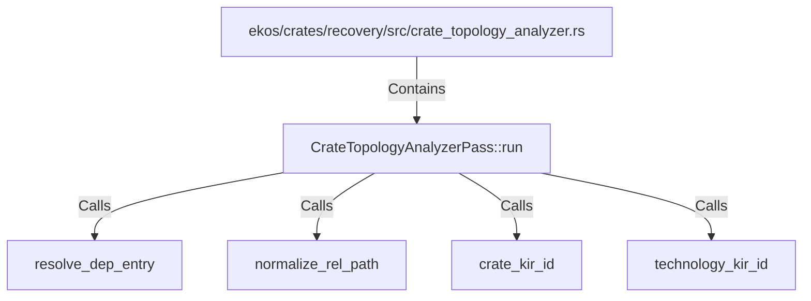

# CrateTopologyAnalyzerPass::run (RustSymbol)

## Properties

| Key | Value |
|---|---|
| `kind` | method |

## Relationships

### Calls

- → resolve_dep_entry (`50c7b5b6-9256-5bee-b6fa-0f18e3741230`)
- → normalize_rel_path (`08bc079b-7ef2-5b04-9e66-2a954215d662`)
- → crate_kir_id (`5f964700-d62f-5814-a893-d9efb38f6406`)
- → technology_kir_id (`84387622-498c-55ae-8159-0d590e168971`)

### Contains

- ← ekos/crates/recovery/src/crate_topology_analyzer.rs (`83764758-1115-54df-bb75-4a49e7334245`)

## Diagram

## Evidence

_No evidence cited._
