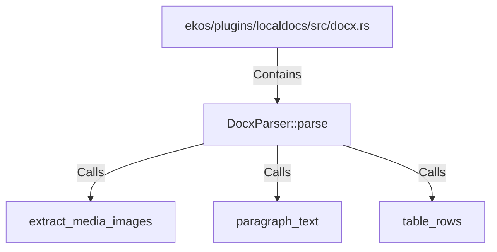

# DocxParser::parse (RustSymbol)

## Properties

| Key | Value |
|---|---|
| `kind` | method |

## Relationships

### Calls

- → extract_media_images (`6e44c2bd-fcda-5588-b6b0-0796a82e8fc7`)
- → paragraph_text (`a86ca4ac-57eb-51f7-be2f-ad53d6c6ee3d`)
- → table_rows (`69fa56db-88c6-5487-8895-f8907d29dee8`)

### Contains

- ← ekos/plugins/localdocs/src/docx.rs (`cb8db45b-ec2c-50f2-8053-0fd63dba3355`)

## Diagram

## Evidence

_No evidence cited._
