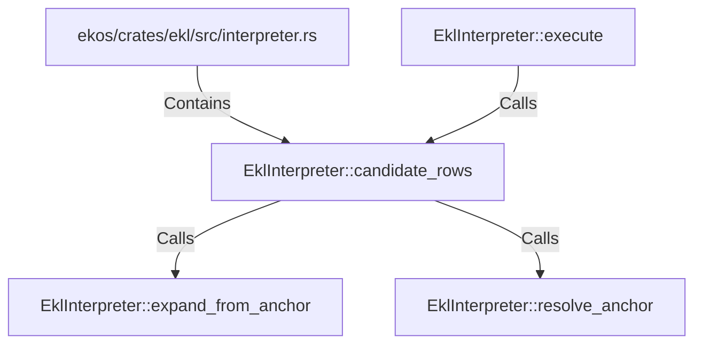

# EklInterpreter::candidate_rows (RustSymbol)

## Properties

| Key | Value |
|---|---|
| `kind` | method |

## Relationships

### Calls

- ← EklInterpreter::execute (`feb95d3d-5916-525d-86e3-ad4cee4ff906`)
- → EklInterpreter::expand_from_anchor (`45d98e4b-c62c-5838-b3ac-7fd7122795a1`)
- → EklInterpreter::resolve_anchor (`822748c3-c82a-526c-993b-53255d03a372`)

### Contains

- ← ekos/crates/ekl/src/interpreter.rs (`9c2cb6e4-ee09-503f-8cf5-ccfaf23ecd79`)

## Diagram

## Evidence

_No evidence cited._
