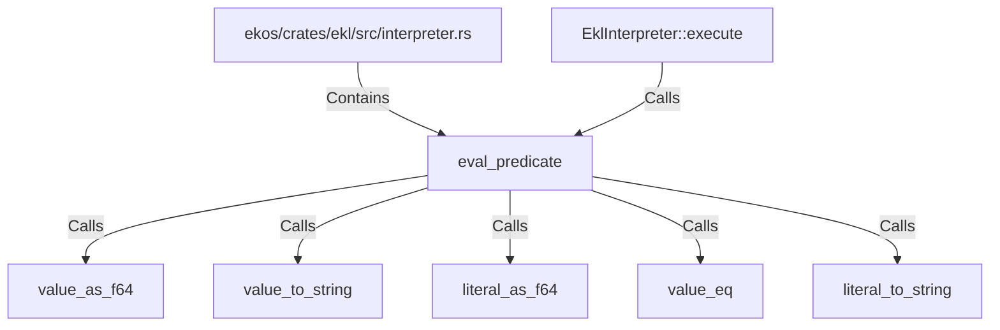

# eval_predicate (RustSymbol)

## Properties

| Key | Value |
|---|---|
| `kind` | function |

## Relationships

### Calls

- ← EklInterpreter::execute (`feb95d3d-5916-525d-86e3-ad4cee4ff906`)
- → value_as_f64 (`8613a3d6-5583-53a9-907c-c715f59b736e`)
- → value_to_string (`2b431c16-e299-5ca5-b60a-18aac4ca949f`)
- → literal_as_f64 (`89a4f306-8073-5546-b7d3-c1c55d138bcf`)
- → value_eq (`92f87789-6991-562b-b876-73c822722296`)
- → literal_to_string (`b99e9e61-15dd-5ac5-be47-b6a1955b3f88`)

### Contains

- ← ekos/crates/ekl/src/interpreter.rs (`9c2cb6e4-ee09-503f-8cf5-ccfaf23ecd79`)

## Diagram

## Evidence

_No evidence cited._
