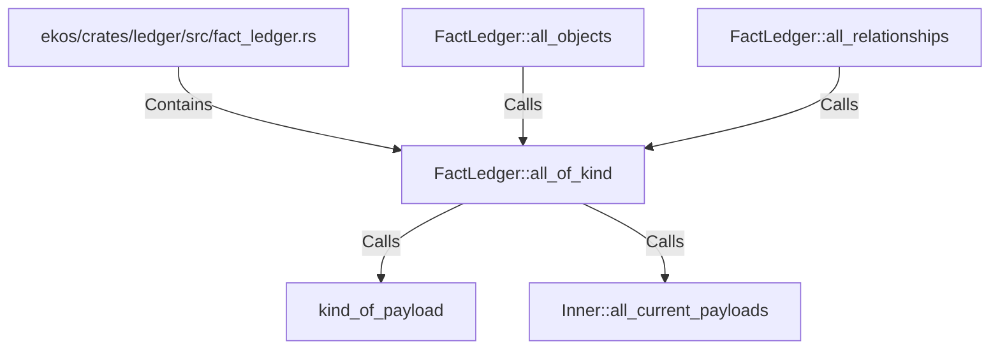

# FactLedger::all_of_kind (RustSymbol)

## Properties

| Key | Value |
|---|---|
| `kind` | method |

## Relationships

### Calls

- ← FactLedger::all_objects (`10d9bb5d-983b-571b-80a4-980eda139690`)
- ← FactLedger::all_relationships (`09e04918-5498-5c94-8d69-c84e67fef17d`)
- → kind_of_payload (`abd8ce5a-e663-50ce-a42f-e2c4a13c43fb`)
- → Inner::all_current_payloads (`cdae7ff9-bb1c-5b30-9d98-ae096c1c521f`)

### Contains

- ← ekos/crates/ledger/src/fact_ledger.rs (`eadcb59e-818f-5d1e-af87-ff29aba11423`)

## Diagram

## Evidence

_No evidence cited._
