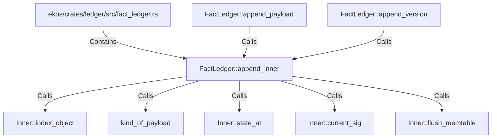

# FactLedger::append_inner (RustSymbol)

## Properties

| Key | Value |
|---|---|
| `kind` | method |

## Relationships

### Calls

- ← FactLedger::append_payload (`59ba0d10-1ac6-5b4b-96f4-c69cac0c6d89`)
- ← FactLedger::append_version (`fa5c07dd-0d4b-5578-b912-83e1377ef34c`)
- → Inner::index_object (`c32e3f6e-7f6e-585f-ae03-f82f97de91ed`)
- → kind_of_payload (`abd8ce5a-e663-50ce-a42f-e2c4a13c43fb`)
- → Inner::state_at (`f8ecc412-0c51-5275-8a0d-2f41777af9ac`)
- → Inner::current_sig (`ba605f6f-3be3-5689-94ce-047beed35236`)
- → Inner::flush_memtable (`ec9d46ec-9576-5ab5-a014-4e0946f5dc5e`)

### Contains

- ← ekos/crates/ledger/src/fact_ledger.rs (`eadcb59e-818f-5d1e-af87-ff29aba11423`)

## Diagram

## Evidence

_No evidence cited._
