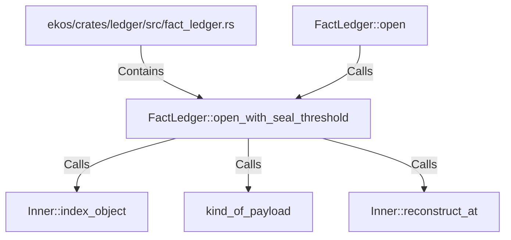

# FactLedger::open_with_seal_threshold (RustSymbol)

## Properties

| Key | Value |
|---|---|
| `kind` | method |

## Relationships

### Calls

- ← FactLedger::open (`0b6a6624-b311-5cb0-84ca-cc0ba0b33ed1`)
- → Inner::index_object (`c32e3f6e-7f6e-585f-ae03-f82f97de91ed`)
- → kind_of_payload (`abd8ce5a-e663-50ce-a42f-e2c4a13c43fb`)
- → Inner::reconstruct_at (`79bd7404-2990-533f-b4f5-b3d167543336`)

### Contains

- ← ekos/crates/ledger/src/fact_ledger.rs (`eadcb59e-818f-5d1e-af87-ff29aba11423`)

## Diagram

## Evidence

_No evidence cited._
