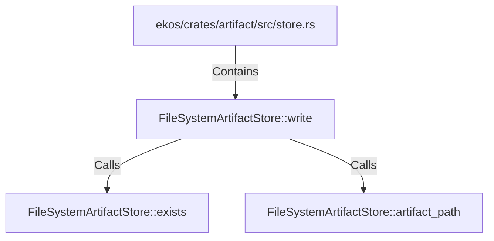

# FileSystemArtifactStore::write (RustSymbol)

## Properties

| Key | Value |
|---|---|
| `kind` | method |

## Relationships

### Calls

- → FileSystemArtifactStore::exists (`09a9951a-1e35-5a79-ae5c-2c9793ae4e34`)
- → FileSystemArtifactStore::artifact_path (`9de3c96c-a715-5997-a156-2a4c8c0b7d70`)

### Contains

- ← ekos/crates/artifact/src/store.rs (`d997f78d-b111-570e-b530-510e98c14df8`)

## Diagram

## Evidence

_No evidence cited._
