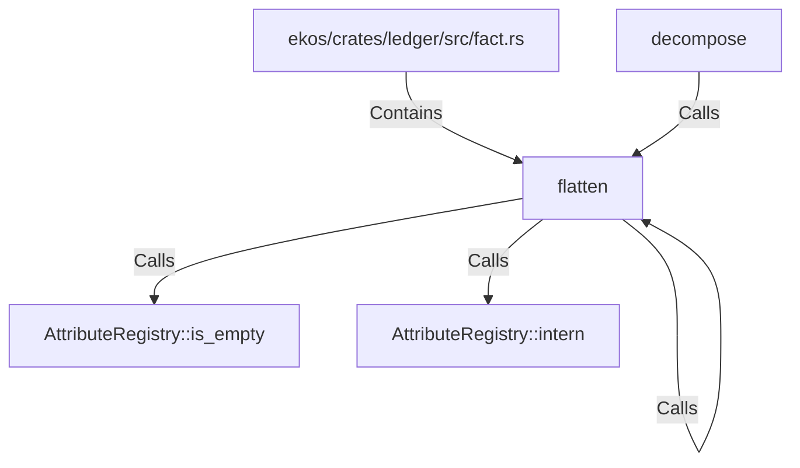

# flatten (RustSymbol)

## Properties

| Key | Value |
|---|---|
| `kind` | function |

## Relationships

### Calls

- ← decompose (`a37fe3f9-4d7a-596d-b18f-e9d9d4931c36`)
- → AttributeRegistry::is_empty (`9cdd0396-a4a6-5ba7-b142-40240858e67e`)
- → flatten (`bf6d717e-62f8-5503-b991-dc1cf3358b97`)
- → AttributeRegistry::intern (`1f29bac1-ffa9-5110-bbe2-6742ce05b657`)

### Contains

- ← ekos/crates/ledger/src/fact.rs (`7837f9fa-7178-5151-a068-e75361336c37`)

## Diagram

## Evidence

_No evidence cited._
