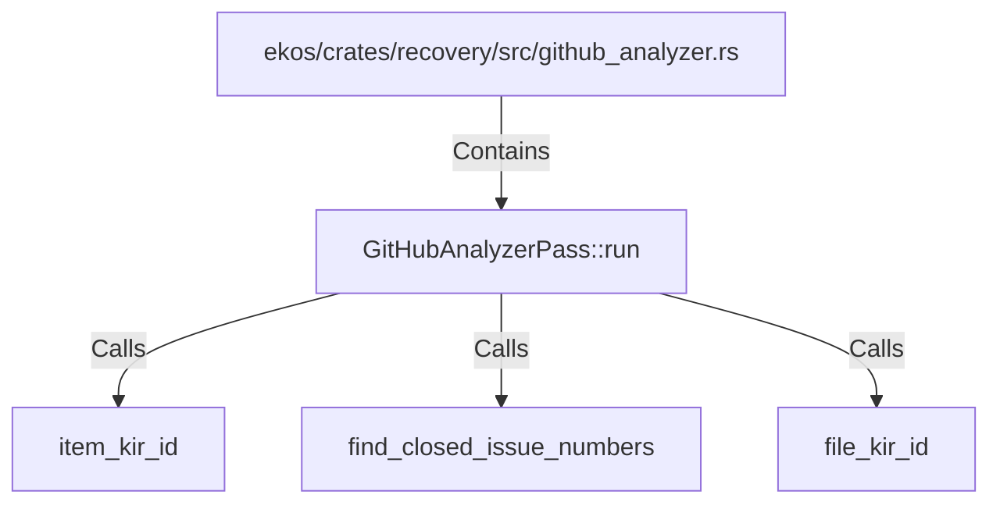

# GitHubAnalyzerPass::run (RustSymbol)

## Properties

| Key | Value |
|---|---|
| `kind` | method |

## Relationships

### Calls

- → item_kir_id (`c279a0e0-4f7a-52d0-8dab-45aa0ac4e0e7`)
- → find_closed_issue_numbers (`5f490787-c057-53eb-80ed-4287e50a0a04`)
- → file_kir_id (`d36e01ce-4f20-520a-a2b9-c3630d65e0e1`)

### Contains

- ← ekos/crates/recovery/src/github_analyzer.rs (`09117129-0fa3-5361-a92f-97212fff36cb`)

## Diagram

## Evidence

_No evidence cited._
