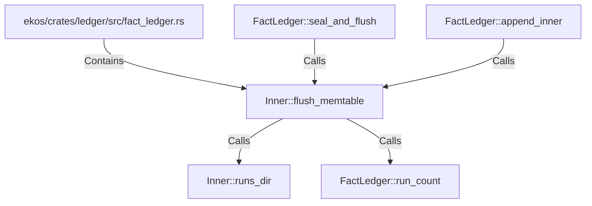

# Inner::flush_memtable (RustSymbol)

## Properties

| Key | Value |
|---|---|
| `kind` | method |

## Relationships

### Calls

- ← FactLedger::seal_and_flush (`928856d4-2abc-5ba6-82ba-c6c17887db5e`)
- ← FactLedger::append_inner (`abbc13e0-8705-5d3c-aa78-d21e9a9882ee`)
- → Inner::runs_dir (`d8a4a271-e1a6-5168-9d3e-6965e3c3c9bc`)
- → FactLedger::run_count (`faf5db4a-a16d-59fe-b9e9-4db75e4bce6a`)

### Contains

- ← ekos/crates/ledger/src/fact_ledger.rs (`eadcb59e-818f-5d1e-af87-ff29aba11423`)

## Diagram

## Evidence

_No evidence cited._
