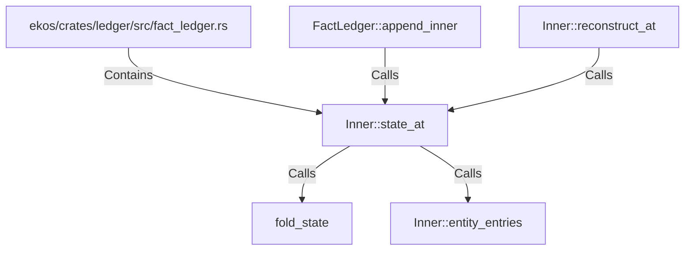

# Inner::state_at (RustSymbol)

## Properties

| Key | Value |
|---|---|
| `kind` | method |

## Relationships

### Calls

- ← FactLedger::append_inner (`abbc13e0-8705-5d3c-aa78-d21e9a9882ee`)
- → fold_state (`42e75b53-6365-5fbc-83a1-26fcd87d8f3c`)
- → Inner::entity_entries (`1ada5b56-9514-5eae-b940-bf8f8ac90935`)
- ← Inner::reconstruct_at (`79bd7404-2990-533f-b4f5-b3d167543336`)

### Contains

- ← ekos/crates/ledger/src/fact_ledger.rs (`eadcb59e-818f-5d1e-af87-ff29aba11423`)

## Diagram

## Evidence

_No evidence cited._
