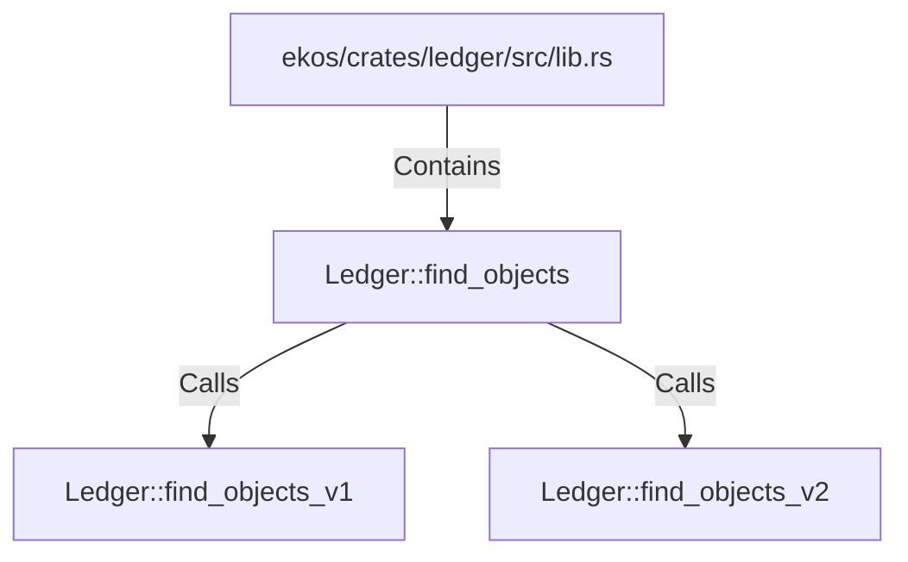

# Ledger::find_objects (RustSymbol)

## Properties

| Key | Value |
|---|---|
| `kind` | method |

## Relationships

### Calls

- → Ledger::find_objects_v1 (`75ce5ae0-9feb-5d69-a1a5-e3e21b368279`)
- → Ledger::find_objects_v2 (`c1f796f9-4eda-5e58-bfc1-90620e984000`)

### Contains

- ← ekos/crates/ledger/src/lib.rs (`21938f45-b767-5933-9e71-12e15ff53eb1`)

## Diagram

## Evidence

_No evidence cited._
