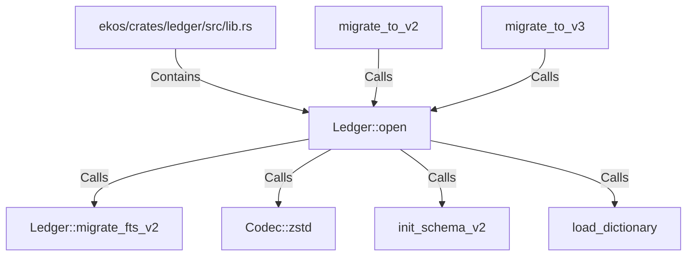

# Ledger::open (RustSymbol)

## Properties

| Key | Value |
|---|---|
| `kind` | method |

## Relationships

### Calls

- → Ledger::migrate_fts_v2 (`2c3a50d1-1ba0-54fd-8509-2493f809dc4c`)
- → Codec::zstd (`90b5c6e9-ab20-5f91-af23-dfa3538059e2`)
- → init_schema_v2 (`229e4c1f-d398-5b84-8348-2003c40d9865`)
- → load_dictionary (`e3ae936e-e904-52b3-8b3e-900dd3178368`)
- ← migrate_to_v2 (`fee5c44c-a2e1-59db-bf5d-b63aff20f8c9`)
- ← migrate_to_v3 (`1dab3f65-615b-56e9-ae9b-e92c32a2cb63`)

### Contains

- ← ekos/crates/ledger/src/lib.rs (`21938f45-b767-5933-9e71-12e15ff53eb1`)

## Diagram

## Evidence

_No evidence cited._
