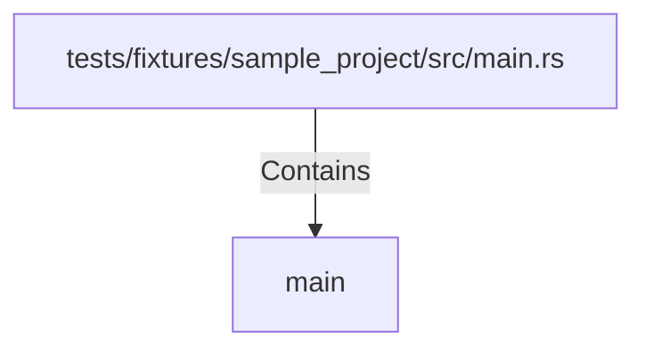

# main (RustSymbol)

## Properties

| Key | Value |
|---|---|
| `kind` | function |

## Relationships

### Contains

- ← tests/fixtures/sample_project/src/main.rs (`72f0c957-ba39-539d-ac75-d1ee912d9e09`)

## Diagram

## Evidence

_No evidence cited._
