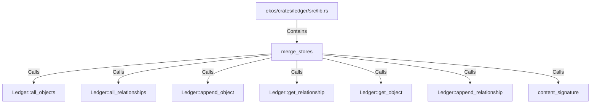

# merge_stores (RustSymbol)

## Properties

| Key | Value |
|---|---|
| `kind` | function |

## Relationships

### Calls

- → Ledger::all_objects (`d640b0e7-cfd1-5693-8c96-022d84598df3`)
- → Ledger::all_relationships (`a4b19ba4-2ef5-50a4-a90e-2107e783f4c8`)
- → Ledger::append_object (`b71bb7ad-337a-518f-9b6e-316178f45928`)
- → Ledger::get_relationship (`c9bf9448-5b90-56cb-b8bb-9a80138af70e`)
- → Ledger::get_object (`bc4b77e9-6e8d-54b0-aa9a-8fc066a535b3`)
- → Ledger::append_relationship (`7cfea349-6f7b-5501-8b20-1291291d672b`)
- → content_signature (`66c7da48-70e5-57fb-9882-5a5b05933963`)

### Contains

- ← ekos/crates/ledger/src/lib.rs (`21938f45-b767-5933-9e71-12e15ff53eb1`)

## Diagram

## Evidence

_No evidence cited._
