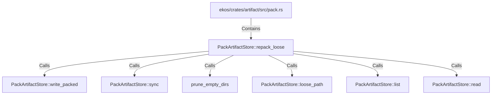

# PackArtifactStore::repack_loose (RustSymbol)

## Properties

| Key | Value |
|---|---|
| `kind` | method |

## Relationships

### Calls

- → PackArtifactStore::write_packed (`2c2ad043-598d-5fcb-bf2d-ed4347ca2ae6`)
- → PackArtifactStore::sync (`df1c1ef5-b760-5b80-a4bd-17b6354cf81b`)
- → prune_empty_dirs (`9b7c0842-a194-54db-ba30-8784f41ab6f6`)
- → PackArtifactStore::loose_path (`a2a2fda7-285e-5052-adf8-adb45d5323ab`)
- → PackArtifactStore::list (`fefadbb6-d1c4-5a6e-8f67-72b562790708`)
- → PackArtifactStore::read (`a5061f98-e89d-569e-a13c-cca36a9e7f0a`)

### Contains

- ← ekos/crates/artifact/src/pack.rs (`98cd7507-d9e7-59e3-acfb-c7ffb05d9f73`)

## Diagram

## Evidence

_No evidence cited._
