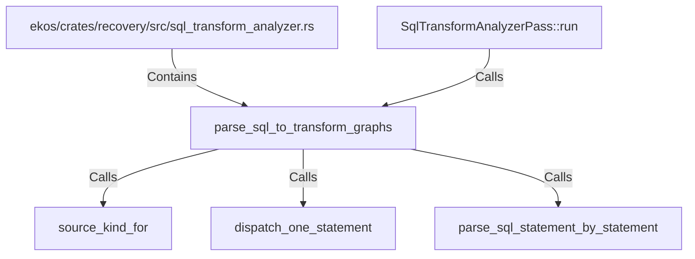

# parse_sql_to_transform_graphs (RustSymbol)

## Properties

| Key | Value |
|---|---|
| `kind` | function |

## Relationships

### Calls

- ← SqlTransformAnalyzerPass::run (`a302c2b7-2c92-59a6-a736-fe9a0a524950`)
- → source_kind_for (`ba3fe2cb-6872-53a6-89b5-d5ee2fcd2402`)
- → dispatch_one_statement (`23b79c8c-1748-5c88-b609-df3f07bd4779`)
- → parse_sql_statement_by_statement (`5496bf59-6cfe-5208-8e5c-2ac011f7f9d8`)

### Contains

- ← ekos/crates/recovery/src/sql_transform_analyzer.rs (`987e3fbb-31ec-576d-b794-7e801336e8c8`)

## Diagram

## Evidence

_No evidence cited._
