# Parser::parse_query (RustSymbol)

## Properties

| Key | Value |
|---|---|
| `kind` | method |

## Relationships

### Calls

- → Parser::advance (`cf978e57-771f-5071-bc41-90610efbe4cd`)
- → Parser::peek_keyword (`6928e6e6-24c5-5c5b-97dc-65a658626c42`)
- → Parser::parse_predicate (`13dfbb5c-4862-500d-a859-066930201fb1`)
- → Parser::expect_num (`cff299ba-b65d-5113-92a4-a72f46de71a1`)
- → Parser::peek_pos (`e00f6daf-8ff4-5f41-9ac9-cdab8bb25782`)
- → Parser::expect_keyword (`251e54ef-3f28-5954-9014-ee9ae388c8ba`)
- → Parser::parse_entity (`a27888f1-6c0b-53ed-a4a8-c95d9fd15c0d`)
- → Parser::expect_ident (`b6c351ae-b268-5230-a6df-6a4cfd1a8f80`)
- → Parser::expect_string (`6e72e754-f9b7-56b0-acdf-067abda4af8a`)
- ← ekl_parse (`590311ca-281e-528a-ae35-6f89aceae476`)

### Contains

- ← ekos/crates/ekl/src/parser.rs (`7eda2531-87c8-5048-92b2-c98483606431`)

## Diagram

```mermaid
graph TD
    n4147b7b99d995be9b91f42752c6f6561["Parser::parse_query"]
    n7eda253187c8504892b2c98483606431["ekos/crates/ekl/src/parser.rs"]
    n7eda253187c8504892b2c98483606431 -->|Contains| n4147b7b99d995be9b91f42752c6f6561
    ncf978e57771f5071bc4190610efbe4cd["Parser::advance"]
    n4147b7b99d995be9b91f42752c6f6561 -->|Calls| ncf978e57771f5071bc4190610efbe4cd
    n6928e6e624c55c5b97dc65a658626c42["Parser::peek_keyword"]
    n4147b7b99d995be9b91f42752c6f6561 -->|Calls| n6928e6e624c55c5b97dc65a658626c42
    n13dfbb5c4862500da859066930201fb1["Parser::parse_predicate"]
    n4147b7b99d995be9b91f42752c6f6561 -->|Calls| n13dfbb5c4862500da859066930201fb1
    ncff299bab65d511392a4a72f46de71a1["Parser::expect_num"]
    n4147b7b99d995be9b91f42752c6f6561 -->|Calls| ncff299bab65d511392a4a72f46de71a1
    ne00f6daf8ff45f419ac9cdab8bb25782["Parser::peek_pos"]
    n4147b7b99d995be9b91f42752c6f6561 -->|Calls| ne00f6daf8ff45f419ac9cdab8bb25782
    n251e54ef3f2859549014ee9ae388c8ba["Parser::expect_keyword"]
    n4147b7b99d995be9b91f42752c6f6561 -->|Calls| n251e54ef3f2859549014ee9ae388c8ba
    na27888f16c0b53eda4a8c95d9fd15c0d["Parser::parse_entity"]
    n4147b7b99d995be9b91f42752c6f6561 -->|Calls| na27888f16c0b53eda4a8c95d9fd15c0d
    nb6c351aeb2685230a6df6a4cfd1a8f80["Parser::expect_ident"]
    n4147b7b99d995be9b91f42752c6f6561 -->|Calls| nb6c351aeb2685230a6df6a4cfd1a8f80
    n6e72e754f9b756b0acdf067abda4af8a["Parser::expect_string"]
    n4147b7b99d995be9b91f42752c6f6561 -->|Calls| n6e72e754f9b756b0acdf067abda4af8a
    n590311ca281e528aae356f89aceae476["ekl_parse"]
    n590311ca281e528aae356f89aceae476 -->|Calls| n4147b7b99d995be9b91f42752c6f6561
```

## Evidence

_No evidence cited._
