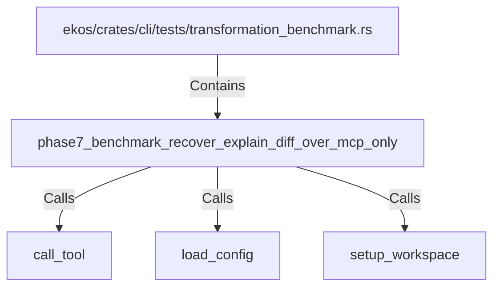

# phase7_benchmark_recover_explain_diff_over_mcp_only (RustSymbol)

## Properties

| Key | Value |
|---|---|
| `kind` | function |

## Relationships

### Calls

- → call_tool (`a762a492-3442-53ed-993e-68a448c9584b`)
- → load_config (`c16a7ca3-09be-58b0-be2c-7ec5f46b0f15`)
- → setup_workspace (`e8ff1e4b-7625-57da-bfa2-e10ecf154d62`)

### Contains

- ← ekos/crates/cli/tests/transformation_benchmark.rs (`6f5dc4e7-3ce8-5dd3-ad8f-f66bbb5fabf5`)

## Diagram

## Evidence

_No evidence cited._
