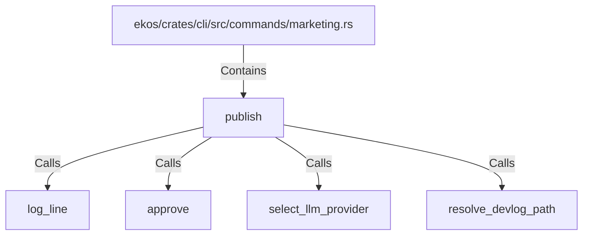

# publish (RustSymbol)

## Properties

| Key | Value |
|---|---|
| `kind` | function |

## Relationships

### Calls

- → log_line (`9b3a0105-69f6-541d-ab3c-6c9ae99908ff`)
- → approve (`76efc638-276d-5610-966b-18f8fc582a09`)
- → select_llm_provider (`824776cf-1030-5c02-acf6-961e14b329e1`)
- → resolve_devlog_path (`8cf1b866-178a-5ca7-b5dd-40b1aa8e7de7`)

### Contains

- ← ekos/crates/cli/src/commands/marketing.rs (`e4550c2d-5dcf-5779-b25d-ac86e4019342`)

## Diagram

## Evidence

_No evidence cited._
