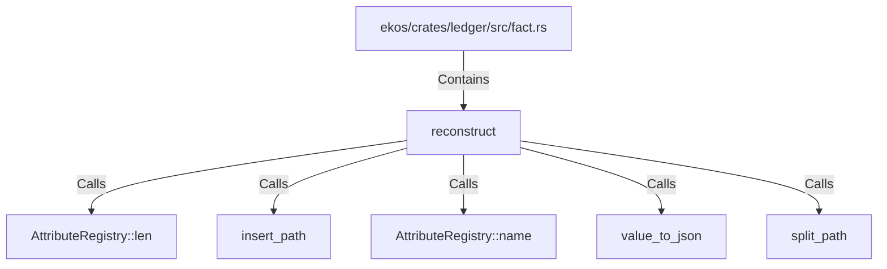

# reconstruct (RustSymbol)

## Properties

| Key | Value |
|---|---|
| `kind` | function |

## Relationships

### Calls

- → AttributeRegistry::len (`c441faa0-58d8-5de0-9575-74cc0e087136`)
- → insert_path (`3e14b1d6-e8f1-5a15-b5f9-d69f821b67cb`)
- → AttributeRegistry::name (`6f8b73f3-5dc9-536f-a72a-eaa0fd944f51`)
- → value_to_json (`cec10e58-166c-56a5-bb1f-471d24727e87`)
- → split_path (`dc099dd2-992b-5e15-9906-cd2ebe704310`)

### Contains

- ← ekos/crates/ledger/src/fact.rs (`7837f9fa-7178-5151-a068-e75361336c37`)

## Diagram

## Evidence

_No evidence cited._
