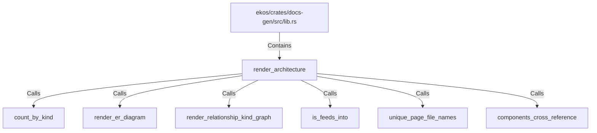

# render_architecture (RustSymbol)

## Properties

| Key | Value |
|---|---|
| `kind` | function |

## Relationships

### Calls

- → count_by_kind (`dd7cd492-c065-5cee-9bd2-2b5fe1a70310`)
- → render_er_diagram (`24aebc21-f28c-5ad9-8802-3013358450bc`)
- → render_relationship_kind_graph (`dd03b8f9-0881-534a-be1c-53991fa0faba`)
- → is_feeds_into (`41dc0e3d-c14a-5c12-a09f-6f9c44fbff80`)
- → unique_page_file_names (`136d1c6d-e6f6-5cda-97d8-3454bbc0d5e7`)
- → components_cross_reference (`a62d90d2-84d3-53ed-9f41-48432d1a2f15`)

### Contains

- ← ekos/crates/docs-gen/src/lib.rs (`6ca4fba0-18e5-59b7-9876-7dae72e2ce0e`)

## Diagram

## Evidence

_No evidence cited._
