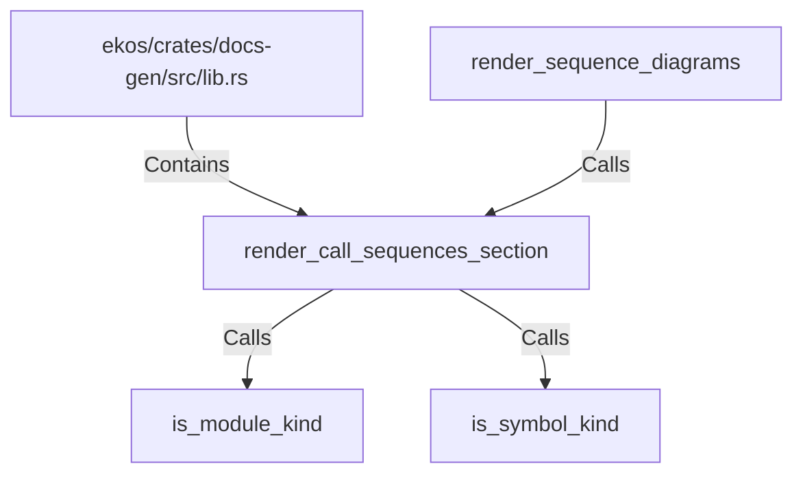

# render_call_sequences_section (RustSymbol)

## Properties

| Key | Value |
|---|---|
| `kind` | function |

## Relationships

### Calls

- ← render_sequence_diagrams (`76f24b81-7126-591a-bfa9-c22e46862167`)
- → is_module_kind (`849c06fb-e0fc-585a-a181-d0ff95b63305`)
- → is_symbol_kind (`c6edd30c-c121-5dad-95d2-155f5391c723`)

### Contains

- ← ekos/crates/docs-gen/src/lib.rs (`6ca4fba0-18e5-59b7-9876-7dae72e2ce0e`)

## Diagram

## Evidence

_No evidence cited._
