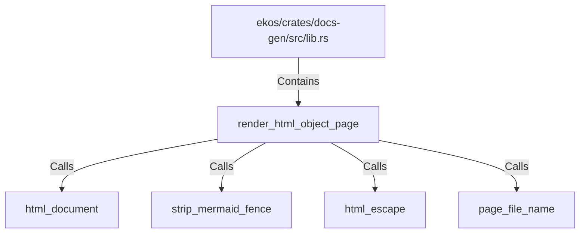

# render_html_object_page (RustSymbol)

## Properties

| Key | Value |
|---|---|
| `kind` | function |

## Relationships

### Calls

- → html_document (`e33469ec-3771-5c0f-a921-6ee66db5430b`)
- → strip_mermaid_fence (`277a818f-2b3f-5dde-8f6a-ae8221017509`)
- → html_escape (`9e97d333-8249-538e-9727-6e1e970dcf37`)
- → page_file_name (`d8b69d99-022e-532f-988b-43e4370b5981`)

### Contains

- ← ekos/crates/docs-gen/src/lib.rs (`6ca4fba0-18e5-59b7-9876-7dae72e2ce0e`)

## Diagram

## Evidence

_No evidence cited._
