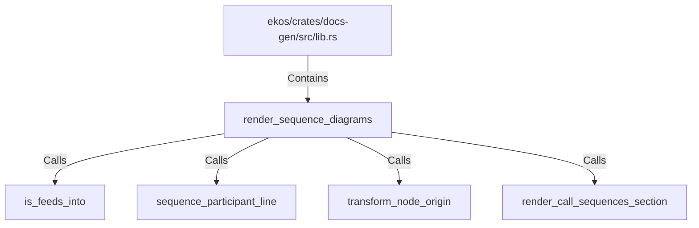

# render_sequence_diagrams (RustSymbol)

## Properties

| Key | Value |
|---|---|
| `kind` | function |

## Relationships

### Calls

- → is_feeds_into (`41dc0e3d-c14a-5c12-a09f-6f9c44fbff80`)
- → sequence_participant_line (`6e251f6e-6278-5d8b-bc16-43cd31f3ea0f`)
- → transform_node_origin (`3102e065-0ad9-5ba4-9213-90dfce5c8300`)
- → render_call_sequences_section (`fbb1d6fe-cedd-5ae7-adea-bdbf8ff8247e`)

### Contains

- ← ekos/crates/docs-gen/src/lib.rs (`6ca4fba0-18e5-59b7-9876-7dae72e2ce0e`)

## Diagram

## Evidence

_No evidence cited._
