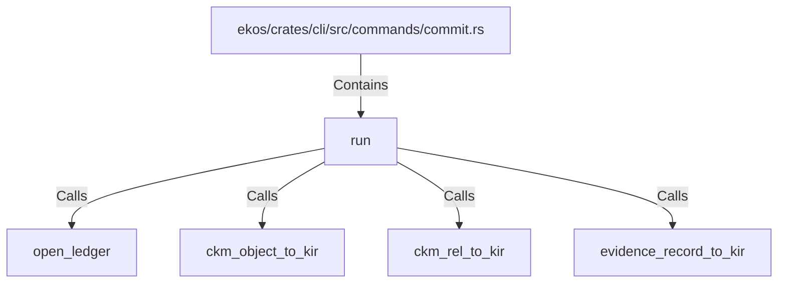

# run (RustSymbol)

## Properties

| Key | Value |
|---|---|
| `kind` | function |

## Relationships

### Calls

- → open_ledger (`1bc6e585-c4e8-5dc5-a6c9-93aadb6ac859`)
- → ckm_object_to_kir (`5d82f3c1-9c9a-501b-8527-e3d1a1305aa7`)
- → ckm_rel_to_kir (`d4e53d27-cd91-5290-b888-f803751ddc3e`)
- → evidence_record_to_kir (`888fe357-b804-5d09-8f1e-26c4d5c7a9f3`)

### Contains

- ← ekos/crates/cli/src/commands/commit.rs (`f48ae11b-a9a7-54f0-8cc6-a192b1641436`)

## Diagram

## Evidence

_No evidence cited._
