# run (RustSymbol)

## Properties

| Key | Value |
|---|---|
| `kind` | function |

## Relationships

### Calls

- → collect_git_artifact_ids (`56a3b0e7-1cb1-5f18-9df7-efc98e4101ea`)
- → collect_crypto_artifact_ids (`bbd7195e-7999-5c51-9ff2-ec42bdfd3e44`)
- → collect_localdocs_artifact_ids (`4be5dd13-69c5-5461-9846-b55f29c40344`)
- → should_register_document_semantics (`474da609-18e5-5107-87b2-e73fc37fc787`)
- → build_llm_provider (`a83c0280-990b-556c-b375-0073c876d6af`)
- → collect_pentaho_artifact_ids (`06cf6e29-711c-5b58-949f-e8676b97964e`)
- → collect_github_artifact_ids (`0b2fc479-d8da-54ca-9693-77523aa07f09`)
- → collect_confluence_artifact_ids (`ca09688e-f94c-5ba2-9780-d3ebdc04f0e9`)
- → collect_python_artifact_ids (`37874b81-bb32-5d99-8957-8edf985f969f`)
- → collect_rust_artifact_ids (`831dd074-4219-50b5-aebb-5d99e3558e4d`)

### Contains

- ← ekos/crates/cli/src/commands/recover.rs (`7e02bcf9-a7b4-5099-8255-130d9ef401bb`)

## Diagram

```mermaid
graph TD
    n786d52250ff95fff99f92f5d73858f4a["run"]
    n7e02bcf9a7b450998255130d9ef401bb["ekos/crates/cli/src/commands/recover.rs"]
    n7e02bcf9a7b450998255130d9ef401bb -->|Contains| n786d52250ff95fff99f92f5d73858f4a
    n56a3b0e71cb15f189df7efc98e4101ea["collect_git_artifact_ids"]
    n786d52250ff95fff99f92f5d73858f4a -->|Calls| n56a3b0e71cb15f189df7efc98e4101ea
    nbbd7195e79995c519ff2ec42bdfd3e44["collect_crypto_artifact_ids"]
    n786d52250ff95fff99f92f5d73858f4a -->|Calls| nbbd7195e79995c519ff2ec42bdfd3e44
    n4be5dd1369c554619846b55f29c40344["collect_localdocs_artifact_ids"]
    n786d52250ff95fff99f92f5d73858f4a -->|Calls| n4be5dd1369c554619846b55f29c40344
    n474da60918e5510787b2e73fc37fc787["should_register_document_semantics"]
    n786d52250ff95fff99f92f5d73858f4a -->|Calls| n474da60918e5510787b2e73fc37fc787
    na83c0280990b556cb3750073c876d6af["build_llm_provider"]
    n786d52250ff95fff99f92f5d73858f4a -->|Calls| na83c0280990b556cb3750073c876d6af
    n06cf6e29711c5b58949fe8676b97964e["collect_pentaho_artifact_ids"]
    n786d52250ff95fff99f92f5d73858f4a -->|Calls| n06cf6e29711c5b58949fe8676b97964e
    n0b2fc479d8da54ca969377523aa07f09["collect_github_artifact_ids"]
    n786d52250ff95fff99f92f5d73858f4a -->|Calls| n0b2fc479d8da54ca969377523aa07f09
    nca09688ef94c5ba29780d3ebdc04f0e9["collect_confluence_artifact_ids"]
    n786d52250ff95fff99f92f5d73858f4a -->|Calls| nca09688ef94c5ba29780d3ebdc04f0e9
    n37874b81bb325d9989578edf985f969f["collect_python_artifact_ids"]
    n786d52250ff95fff99f92f5d73858f4a -->|Calls| n37874b81bb325d9989578edf985f969f
    n831dd074421950b5aebb5d99e3558e4d["collect_rust_artifact_ids"]
    n786d52250ff95fff99f92f5d73858f4a -->|Calls| n831dd074421950b5aebb5d99e3558e4d
```

## Evidence

_No evidence cited._
