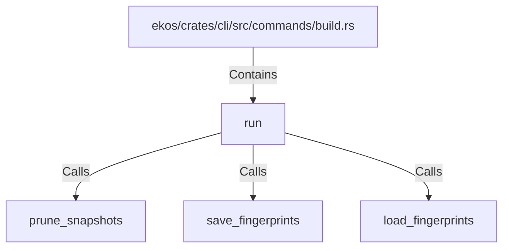

# run (RustSymbol)

## Properties

| Key | Value |
|---|---|
| `kind` | function |

## Relationships

### Calls

- → prune_snapshots (`f9f60185-26ce-5298-b387-17a129857d00`)
- → save_fingerprints (`b7ee0369-14d2-5ac7-a8b9-893ebb6644d7`)
- → load_fingerprints (`ab00e332-2b4e-50ad-9ea7-b0178ac4cd6b`)

### Contains

- ← ekos/crates/cli/src/commands/build.rs (`306def2e-bd5a-5784-9453-692c119e8d43`)

## Diagram

## Evidence

_No evidence cited._
