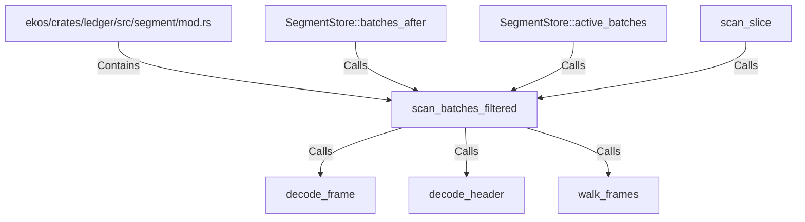

# scan_batches_filtered (RustSymbol)

## Properties

| Key | Value |
|---|---|
| `kind` | function |

## Relationships

### Calls

- ← SegmentStore::batches_after (`ecc4c700-b537-5187-a5a9-ee023b1d6bf4`)
- ← SegmentStore::active_batches (`4129d5a0-4d0d-52d4-a36e-ea91694c7f1f`)
- ← scan_slice (`ff90a0b4-5f45-58af-bb52-2dbcb2df5ccc`)
- → decode_frame (`ac39fcb4-9dc0-595d-af9b-bce1eb69f50c`)
- → decode_header (`c0caddb8-2278-5f35-b313-f93159e56dbf`)
- → walk_frames (`630f07e4-a407-59c6-bdb6-e7ed592a703b`)

### Contains

- ← ekos/crates/ledger/src/segment/mod.rs (`80a64e0a-b0ac-51df-b3be-128cddd1cc83`)

## Diagram

## Evidence

_No evidence cited._
