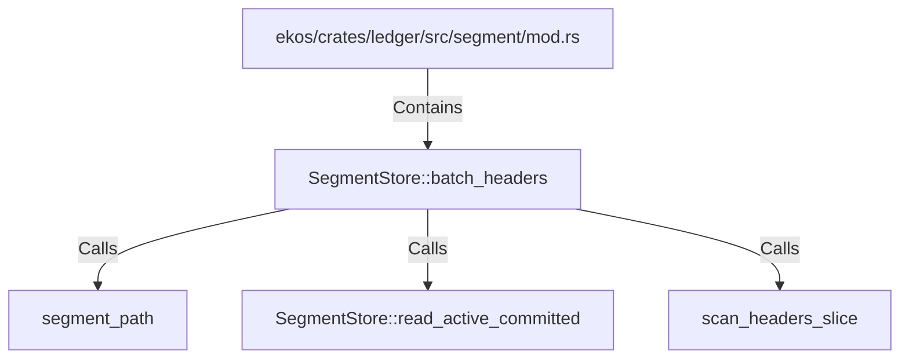

# SegmentStore::batch_headers (RustSymbol)

## Properties

| Key | Value |
|---|---|
| `kind` | method |

## Relationships

### Calls

- → segment_path (`a07b97cc-69e4-5c35-bedf-11119542af72`)
- → SegmentStore::read_active_committed (`2119ef15-fc0f-5785-9e29-d84e4f14ac23`)
- → scan_headers_slice (`58cd3f37-9374-5ff9-aeea-9fef60615002`)

### Contains

- ← ekos/crates/ledger/src/segment/mod.rs (`80a64e0a-b0ac-51df-b3be-128cddd1cc83`)

## Diagram

## Evidence

_No evidence cited._
