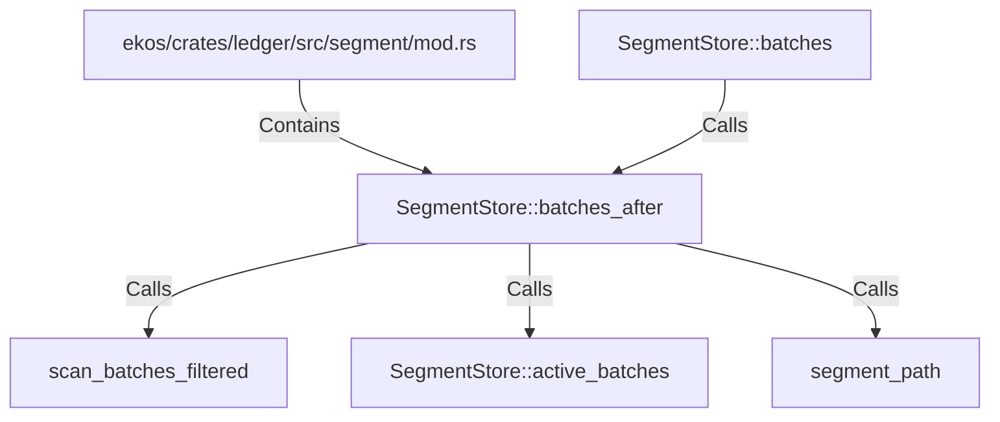

# SegmentStore::batches_after (RustSymbol)

## Properties

| Key | Value |
|---|---|
| `kind` | method |

## Relationships

### Calls

- ← SegmentStore::batches (`b9ee061b-7f32-5424-9ce5-e6bdd92b9a51`)
- → scan_batches_filtered (`cefece15-35d7-567a-889d-48edf2ee6fe1`)
- → SegmentStore::active_batches (`4129d5a0-4d0d-52d4-a36e-ea91694c7f1f`)
- → segment_path (`a07b97cc-69e4-5c35-bedf-11119542af72`)

### Contains

- ← ekos/crates/ledger/src/segment/mod.rs (`80a64e0a-b0ac-51df-b3be-128cddd1cc83`)

## Diagram

## Evidence

_No evidence cited._
