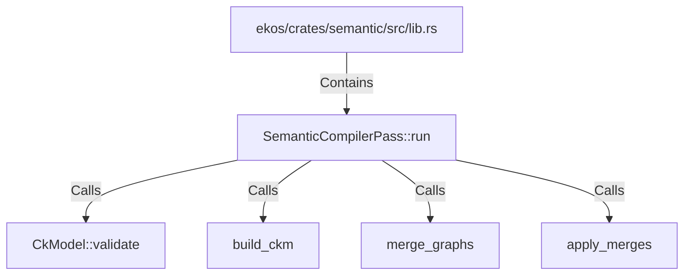

# SemanticCompilerPass::run (RustSymbol)

## Properties

| Key | Value |
|---|---|
| `kind` | method |

## Relationships

### Calls

- → CkModel::validate (`de0b1feb-df36-5b3d-89ad-69c32f6bb7c2`)
- → build_ckm (`2629dd98-2de4-577c-9729-5674e1bef671`)
- → merge_graphs (`af354743-f94c-501c-8907-0a51ccdae017`)
- → apply_merges (`0fe2ab6b-10b6-50bf-be74-c6ec8ad47104`)

### Contains

- ← ekos/crates/semantic/src/lib.rs (`54021a72-4846-550c-960f-e63303e4d103`)

## Diagram

## Evidence

_No evidence cited._
