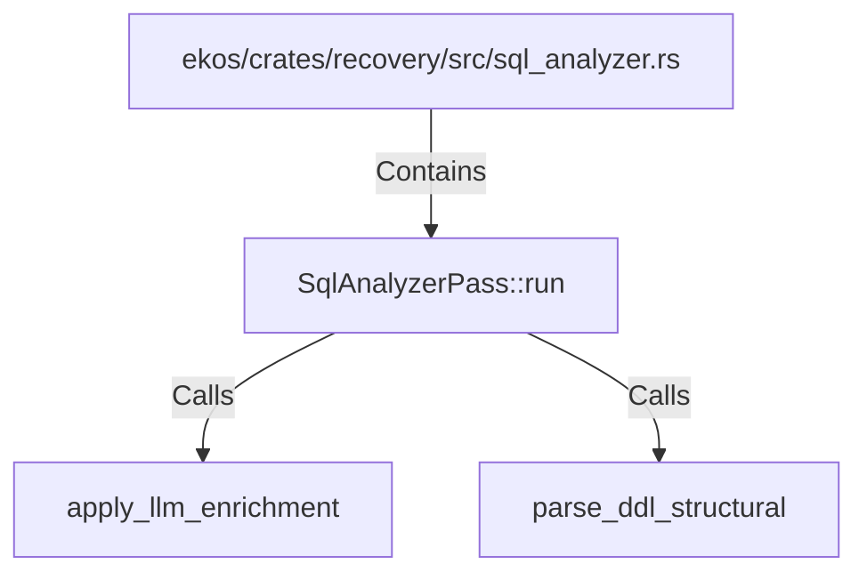

# SqlAnalyzerPass::run (RustSymbol)

## Properties

| Key | Value |
|---|---|
| `kind` | method |

## Relationships

### Calls

- → apply_llm_enrichment (`42cf8fb1-8f3d-51ce-b3c7-1b465fd82f18`)
- → parse_ddl_structural (`627d6f75-f3e8-5277-8b29-ff55036731c3`)

### Contains

- ← ekos/crates/recovery/src/sql_analyzer.rs (`cd768c5e-1640-51c3-b6ec-cb7ac78ade6d`)

## Diagram

## Evidence

_No evidence cited._
