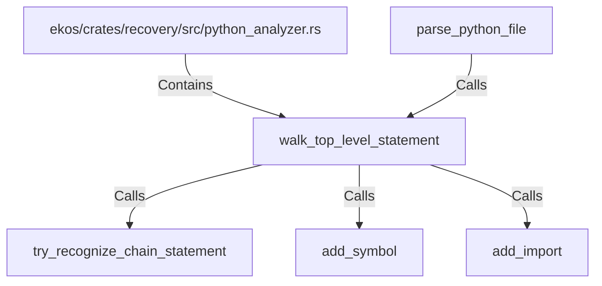

# walk_top_level_statement (RustSymbol)

## Properties

| Key | Value |
|---|---|
| `kind` | function |

## Relationships

### Calls

- ← parse_python_file (`72ff02a8-b7ba-5481-b85d-c5b408ab50e4`)
- → try_recognize_chain_statement (`1c28e117-91f6-543a-9528-4a070d7a4528`)
- → add_symbol (`458e9ef2-0f1a-57ae-8965-7f762081285d`)
- → add_import (`89c6ca8d-8538-5378-962b-dd78b293813c`)

### Contains

- ← ekos/crates/recovery/src/python_analyzer.rs (`196ca3fd-e85c-5ab9-a142-50f63dc586b9`)

## Diagram

## Evidence

_No evidence cited._
