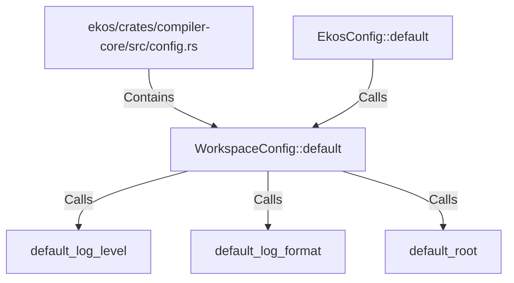

# WorkspaceConfig::default (RustSymbol)

## Properties

| Key | Value |
|---|---|
| `kind` | method |

## Relationships

### Calls

- → default_log_level (`09665155-ef9e-5259-b379-8452b328264d`)
- → default_log_format (`08ad7fde-95bd-5d73-8bc4-8cb5a70b8fd9`)
- → default_root (`7b4baf1d-a71f-5879-b162-60a8f58bb004`)
- ← EkosConfig::default (`96f3be94-9761-5db0-b99a-0c705c9c55d0`)

### Contains

- ← ekos/crates/compiler-core/src/config.rs (`d0747f34-25e1-5426-80eb-a54fffcac598`)

## Diagram

## Evidence

_No evidence cited._
