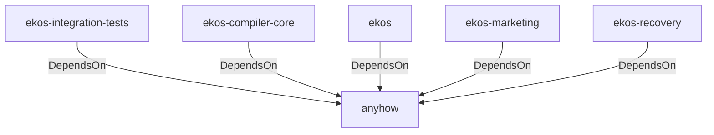

# anyhow (Technology)

## Properties

_No compiled properties._

## Relationships

### DependsOn

- ← ekos-integration-tests (`063808f9-5f19-5d62-b3dd-69eaa93d44cb`) — evidence: ekos-integration-tests depends on anyhow 1
- ← ekos-compiler-core (`2690bc0d-0233-516f-b969-9e87432f623d`) — evidence: ekos-compiler-core depends on anyhow 1
- ← ekos (`abd31cd9-b31d-54c5-87cd-8a4a5b9a30a0`) — evidence: ekos depends on anyhow 1
- ← ekos-marketing (`18dba45d-9534-5035-bd6f-df6b370079ac`) — evidence: ekos-marketing depends on anyhow 1
- ← ekos-recovery (`28244ebb-4e16-5e8d-a637-5e750d01f2b8`) — evidence: ekos-recovery depends on anyhow 1

## Diagram

## Evidence

- `bbbb8b39-1bde-4e77-92ce-9464d122efa7` — ekos-integration-tests depends on anyhow 1 (confidence: 1.00)
- `55ac936a-f417-424a-83e1-056c48f6e871` — ekos-compiler-core depends on anyhow 1 (confidence: 1.00)
- `04e853af-e125-4171-922c-56eb6bb5e1a3` — ekos depends on anyhow 1 (confidence: 1.00)
- `932a84b9-2ab6-481e-a3d2-03bbb253b1ec` — ekos-marketing depends on anyhow 1 (confidence: 1.00)
- `a385979e-0d58-4849-a2cd-12472252944a` — ekos-recovery depends on anyhow 1 (confidence: 1.00)
