# async-trait (Technology)

## Properties

_No compiled properties._

## Relationships

### DependsOn

- ← ekos-semantic (`f82d9ce0-df2a-5af8-9f9a-2bd5f8484839`) — evidence: ekos-semantic depends on async-trait 0.1
- ← ekos-runtime (`f4cd2d3b-f0b0-5234-ab2b-39de3275d717`) — evidence: ekos-runtime depends on async-trait 0.1
- ← ekos-compiler-core (`2690bc0d-0233-516f-b969-9e87432f623d`) — evidence: ekos-compiler-core depends on async-trait 0.1
- ← ekos-observation-sdk (`9a955a3a-55bc-587a-942d-fb81d6260052`) — evidence: ekos-observation-sdk depends on async-trait 0.1
- ← ekos-marketing (`18dba45d-9534-5035-bd6f-df6b370079ac`) — evidence: ekos-marketing depends on async-trait 0.1
- ← ekos-recovery (`28244ebb-4e16-5e8d-a637-5e750d01f2b8`) — evidence: ekos-recovery depends on async-trait 0.1
- ← ekos-plugin-oracle (`66e4bdc1-07c6-5f6e-9150-d6db731cf29d`) — evidence: ekos-plugin-oracle depends on async-trait 0.1
- ← ekos-plugin-confluence (`e8d1a3c9-e7b2-5084-bdfc-569e7b604054`) — evidence: ekos-plugin-confluence depends on async-trait 0.1
- ← ekos-plugin-localdocs (`0659fbf3-d2f4-54ba-835f-a7f6f875a7d1`) — evidence: ekos-plugin-localdocs depends on async-trait 0.1
- ← ekos-plugin-sap (`870bf8c4-5212-524c-a442-6fe561baf29d`) — evidence: ekos-plugin-sap depends on async-trait 0.1
- ← ekos-plugin-github (`aff4d491-b33f-56d7-b0ba-e03e884983fd`) — evidence: ekos-plugin-github depends on async-trait 0.1
- ← ekos-plugin-pentaho (`dac1d743-a50e-57a9-8acb-56e29a47ef5e`) — evidence: ekos-plugin-pentaho depends on async-trait 0.1
- ← ekos-plugin-file (`06b65958-abb7-5fe1-a6ee-d35946d39062`) — evidence: ekos-plugin-file depends on async-trait 0.1
- ← ekos-plugin-python (`020c78ca-f337-542f-b351-8b4201393bbb`) — evidence: ekos-plugin-python depends on async-trait 0.1
- ← ekos-plugin-git (`df977fc8-e004-518e-b267-581520ccd448`) — evidence: ekos-plugin-git depends on async-trait 0.1
- ← ekos-plugin-fabric (`aeb0688d-1d00-58a5-b6d6-245dfefa74cf`) — evidence: ekos-plugin-fabric depends on async-trait 0.1
- ← ekos-plugin-snowflake (`0a005794-329c-5fc3-a395-a5c55cf9cfcb`) — evidence: ekos-plugin-snowflake depends on async-trait 0.1
- ← ekos-plugin-salesforce (`a9e38433-d550-5523-8c13-4f5c31f4e742`) — evidence: ekos-plugin-salesforce depends on async-trait 0.1
- ← ekos-plugin-crypto (`835d6e67-5bb0-53e7-9104-338881612548`) — evidence: ekos-plugin-crypto depends on async-trait 0.1
- ← ekos-plugin-rust (`07179bab-d486-5b14-8c68-6e743e45b3f6`) — evidence: ekos-plugin-rust depends on async-trait 0.1

## Diagram

```mermaid
graph TD
    n7c905290824b57e0a55915ff1499b4d6["async-trait"]
    nf82d9ce0df2a5af89f9a2bd5f8484839["ekos-semantic"]
    nf82d9ce0df2a5af89f9a2bd5f8484839 -->|DependsOn| n7c905290824b57e0a55915ff1499b4d6
    nf4cd2d3bf0b05234ab2b39de3275d717["ekos-runtime"]
    nf4cd2d3bf0b05234ab2b39de3275d717 -->|DependsOn| n7c905290824b57e0a55915ff1499b4d6
    n2690bc0d0233516fb9699e87432f623d["ekos-compiler-core"]
    n2690bc0d0233516fb9699e87432f623d -->|DependsOn| n7c905290824b57e0a55915ff1499b4d6
    n9a955a3a55bc587a942dfb81d6260052["ekos-observation-sdk"]
    n9a955a3a55bc587a942dfb81d6260052 -->|DependsOn| n7c905290824b57e0a55915ff1499b4d6
    n18dba45d95345035bd6fdf6b370079ac["ekos-marketing"]
    n18dba45d95345035bd6fdf6b370079ac -->|DependsOn| n7c905290824b57e0a55915ff1499b4d6
    n28244ebb4e165e8da6375e750d01f2b8["ekos-recovery"]
    n28244ebb4e165e8da6375e750d01f2b8 -->|DependsOn| n7c905290824b57e0a55915ff1499b4d6
    n66e4bdc107c65f6e9150d6db731cf29d["ekos-plugin-oracle"]
    n66e4bdc107c65f6e9150d6db731cf29d -->|DependsOn| n7c905290824b57e0a55915ff1499b4d6
    ne8d1a3c9e7b25084bdfc569e7b604054["ekos-plugin-confluence"]
    ne8d1a3c9e7b25084bdfc569e7b604054 -->|DependsOn| n7c905290824b57e0a55915ff1499b4d6
    n0659fbf3d2f454ba835fa7f6f875a7d1["ekos-plugin-localdocs"]
    n0659fbf3d2f454ba835fa7f6f875a7d1 -->|DependsOn| n7c905290824b57e0a55915ff1499b4d6
    n870bf8c45212524ca4426fe561baf29d["ekos-plugin-sap"]
    n870bf8c45212524ca4426fe561baf29d -->|DependsOn| n7c905290824b57e0a55915ff1499b4d6
    naff4d491b33f56d7b0bae03e884983fd["ekos-plugin-github"]
    naff4d491b33f56d7b0bae03e884983fd -->|DependsOn| n7c905290824b57e0a55915ff1499b4d6
    ndac1d743a50e57a98acb56e29a47ef5e["ekos-plugin-pentaho"]
    ndac1d743a50e57a98acb56e29a47ef5e -->|DependsOn| n7c905290824b57e0a55915ff1499b4d6
    n06b65958abb75fe1a6eed35946d39062["ekos-plugin-file"]
    n06b65958abb75fe1a6eed35946d39062 -->|DependsOn| n7c905290824b57e0a55915ff1499b4d6
    n020c78caf337542fb3518b4201393bbb["ekos-plugin-python"]
    n020c78caf337542fb3518b4201393bbb -->|DependsOn| n7c905290824b57e0a55915ff1499b4d6
    ndf977fc8e004518eb267581520ccd448["ekos-plugin-git"]
    ndf977fc8e004518eb267581520ccd448 -->|DependsOn| n7c905290824b57e0a55915ff1499b4d6
    naeb0688d1d0058a5b6d6245dfefa74cf["ekos-plugin-fabric"]
    naeb0688d1d0058a5b6d6245dfefa74cf -->|DependsOn| n7c905290824b57e0a55915ff1499b4d6
    n0a005794329c5fc3a395a5c55cf9cfcb["ekos-plugin-snowflake"]
    n0a005794329c5fc3a395a5c55cf9cfcb -->|DependsOn| n7c905290824b57e0a55915ff1499b4d6
    na9e38433d55055238c134f5c31f4e742["ekos-plugin-salesforce"]
    na9e38433d55055238c134f5c31f4e742 -->|DependsOn| n7c905290824b57e0a55915ff1499b4d6
    n835d6e675bb053e79104338881612548["ekos-plugin-crypto"]
    n835d6e675bb053e79104338881612548 -->|DependsOn| n7c905290824b57e0a55915ff1499b4d6
    n07179babd4865b148c686e743e45b3f6["ekos-plugin-rust"]
    n07179babd4865b148c686e743e45b3f6 -->|DependsOn| n7c905290824b57e0a55915ff1499b4d6
```

## Evidence

- `03d4782b-1314-499a-8678-c0aa5d231f48` — ekos-semantic depends on async-trait 0.1 (confidence: 1.00)
- `97ab7f18-d046-4249-83e6-f3e50adb744b` — ekos-runtime depends on async-trait 0.1 (confidence: 1.00)
- `fcb6defc-a70f-4fbc-94ea-60da96c72228` — ekos-compiler-core depends on async-trait 0.1 (confidence: 1.00)
- `bf8fcffe-7465-460b-99b1-a453b6f94e52` — ekos-observation-sdk depends on async-trait 0.1 (confidence: 1.00)
- `f7a50b19-e58f-4991-8912-d95128d24a01` — ekos-marketing depends on async-trait 0.1 (confidence: 1.00)
- `8952ac64-9e88-45fa-905e-6f674837f5e7` — ekos-recovery depends on async-trait 0.1 (confidence: 1.00)
- `68bf8cde-67ad-4d38-a4d1-6be8d6bd2ae9` — ekos-plugin-oracle depends on async-trait 0.1 (confidence: 1.00)
- `07996fba-3646-413d-b48e-e69e64c04602` — ekos-plugin-confluence depends on async-trait 0.1 (confidence: 1.00)
- `6e612cf5-fc11-4815-8d7b-6d062842bf34` — ekos-plugin-localdocs depends on async-trait 0.1 (confidence: 1.00)
- `05ed9b14-beca-4947-820c-6730950673c8` — ekos-plugin-sap depends on async-trait 0.1 (confidence: 1.00)
- `2b2bc79a-804c-4fde-bec4-a5b61a65992c` — ekos-plugin-github depends on async-trait 0.1 (confidence: 1.00)
- `a6eae1bc-74f4-4f14-80cd-ebf00dc2c08f` — ekos-plugin-pentaho depends on async-trait 0.1 (confidence: 1.00)
- `f1212282-efd9-4f02-b15f-6dc3089a3423` — ekos-plugin-file depends on async-trait 0.1 (confidence: 1.00)
- `9bcbb523-a4fb-4b10-a97a-9da7d1e9c978` — ekos-plugin-python depends on async-trait 0.1 (confidence: 1.00)
- `9b057a08-3de0-4aca-be40-c02066b5caeb` — ekos-plugin-git depends on async-trait 0.1 (confidence: 1.00)
- `725818f1-cda7-437c-9c6b-3eefcdb9d0f9` — ekos-plugin-fabric depends on async-trait 0.1 (confidence: 1.00)
- `db80f4ad-b76c-43bb-87ce-6b754f0aa606` — ekos-plugin-snowflake depends on async-trait 0.1 (confidence: 1.00)
- `33d21471-ea05-4166-9dac-ca9bbcb82f78` — ekos-plugin-salesforce depends on async-trait 0.1 (confidence: 1.00)
- `a2030b68-4b39-4266-af45-e251039fb7e4` — ekos-plugin-crypto depends on async-trait 0.1 (confidence: 1.00)
- `226d0238-84c8-4e71-88cc-9cb7b5bdfa94` — ekos-plugin-rust depends on async-trait 0.1 (confidence: 1.00)
