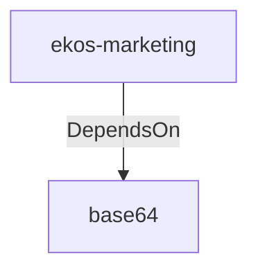

# base64 (Technology)

## Properties

_No compiled properties._

## Relationships

### DependsOn

- ← ekos-marketing (`18dba45d-9534-5035-bd6f-df6b370079ac`) — evidence: ekos-marketing depends on base64 0.22

## Diagram

## Evidence

- `8e79b31a-c087-424c-824c-58d98f7c59a0` — ekos-marketing depends on base64 0.22 (confidence: 1.00)
