# chrono (Technology)

## Properties

_No compiled properties._

## Relationships

### DependsOn

- ← ekos-semantic (`f82d9ce0-df2a-5af8-9f9a-2bd5f8484839`) — evidence: ekos-semantic depends on chrono 0.4
- ← ekos-runtime (`f4cd2d3b-f0b0-5234-ab2b-39de3275d717`) — evidence: ekos-runtime depends on chrono 0.4
- ← ekos-compiler-core (`2690bc0d-0233-516f-b969-9e87432f623d`) — evidence: ekos-compiler-core depends on chrono 0.4
- ← ekos-kir (`7e3bc0de-d888-55cd-aa9a-f333f6e2cbb2`) — evidence: ekos-kir depends on chrono 0.4
- ← ekos (`abd31cd9-b31d-54c5-87cd-8a4a5b9a30a0`) — evidence: ekos depends on chrono 0.4
- ← ekos-observation-sdk (`9a955a3a-55bc-587a-942d-fb81d6260052`) — evidence: ekos-observation-sdk depends on chrono 0.4
- ← ekos-artifact (`8806bf54-6364-5052-b85a-cef4344e8f19`) — evidence: ekos-artifact depends on chrono 0.4
- ← ekos-common (`dc169f0a-98f1-5c7c-8dd0-1dbc8504e9c9`) — evidence: ekos-common depends on chrono 0.4
- ← ekos-marketing (`18dba45d-9534-5035-bd6f-df6b370079ac`) — evidence: ekos-marketing depends on chrono 0.4
- ← ekos-recovery (`28244ebb-4e16-5e8d-a637-5e750d01f2b8`) — evidence: ekos-recovery depends on chrono 0.4
- ← ekos-ledger (`9c977335-c421-519c-a889-558f0487574e`) — evidence: ekos-ledger depends on chrono 0.4
- ← ekos-plugin-git (`df977fc8-e004-518e-b267-581520ccd448`) — evidence: ekos-plugin-git depends on chrono 0.4
- ← ekos-plugin-crypto (`835d6e67-5bb0-53e7-9104-338881612548`) — evidence: ekos-plugin-crypto depends on chrono 0.4

## Diagram

```mermaid
graph TD
    n0d184cc12483516da0b50b6bfad54805["chrono"]
    nf82d9ce0df2a5af89f9a2bd5f8484839["ekos-semantic"]
    nf82d9ce0df2a5af89f9a2bd5f8484839 -->|DependsOn| n0d184cc12483516da0b50b6bfad54805
    nf4cd2d3bf0b05234ab2b39de3275d717["ekos-runtime"]
    nf4cd2d3bf0b05234ab2b39de3275d717 -->|DependsOn| n0d184cc12483516da0b50b6bfad54805
    n2690bc0d0233516fb9699e87432f623d["ekos-compiler-core"]
    n2690bc0d0233516fb9699e87432f623d -->|DependsOn| n0d184cc12483516da0b50b6bfad54805
    n7e3bc0ded88855cdaa9af333f6e2cbb2["ekos-kir"]
    n7e3bc0ded88855cdaa9af333f6e2cbb2 -->|DependsOn| n0d184cc12483516da0b50b6bfad54805
    nabd31cd9b31d54c587cd8a4a5b9a30a0["ekos"]
    nabd31cd9b31d54c587cd8a4a5b9a30a0 -->|DependsOn| n0d184cc12483516da0b50b6bfad54805
    n9a955a3a55bc587a942dfb81d6260052["ekos-observation-sdk"]
    n9a955a3a55bc587a942dfb81d6260052 -->|DependsOn| n0d184cc12483516da0b50b6bfad54805
    n8806bf5463645052b85acef4344e8f19["ekos-artifact"]
    n8806bf5463645052b85acef4344e8f19 -->|DependsOn| n0d184cc12483516da0b50b6bfad54805
    ndc169f0a98f15c7c8dd01dbc8504e9c9["ekos-common"]
    ndc169f0a98f15c7c8dd01dbc8504e9c9 -->|DependsOn| n0d184cc12483516da0b50b6bfad54805
    n18dba45d95345035bd6fdf6b370079ac["ekos-marketing"]
    n18dba45d95345035bd6fdf6b370079ac -->|DependsOn| n0d184cc12483516da0b50b6bfad54805
    n28244ebb4e165e8da6375e750d01f2b8["ekos-recovery"]
    n28244ebb4e165e8da6375e750d01f2b8 -->|DependsOn| n0d184cc12483516da0b50b6bfad54805
    n9c977335c421519ca889558f0487574e["ekos-ledger"]
    n9c977335c421519ca889558f0487574e -->|DependsOn| n0d184cc12483516da0b50b6bfad54805
    ndf977fc8e004518eb267581520ccd448["ekos-plugin-git"]
    ndf977fc8e004518eb267581520ccd448 -->|DependsOn| n0d184cc12483516da0b50b6bfad54805
    n835d6e675bb053e79104338881612548["ekos-plugin-crypto"]
    n835d6e675bb053e79104338881612548 -->|DependsOn| n0d184cc12483516da0b50b6bfad54805
```

## Evidence

- `f2bd0cb8-5256-4ae4-bf3a-089c782cc095` — ekos-semantic depends on chrono 0.4 (confidence: 1.00)
- `53a6b85f-8f62-483d-a47d-7ce52b2d63a2` — ekos-runtime depends on chrono 0.4 (confidence: 1.00)
- `a9d962ce-5689-4a86-b0cf-4720ba1456aa` — ekos-compiler-core depends on chrono 0.4 (confidence: 1.00)
- `eb29bfc9-eeda-467d-b23b-a746d4cb6e04` — ekos-kir depends on chrono 0.4 (confidence: 1.00)
- `82a5088d-ea59-4633-822d-408e4f65aede` — ekos depends on chrono 0.4 (confidence: 1.00)
- `159a2b78-11a2-4b29-8f2d-8a55f7aa30b3` — ekos-observation-sdk depends on chrono 0.4 (confidence: 1.00)
- `c6ce42c7-563d-4fbf-8cb8-cf203016b793` — ekos-artifact depends on chrono 0.4 (confidence: 1.00)
- `31d605a9-4715-45b9-abfd-8e031942ac12` — ekos-common depends on chrono 0.4 (confidence: 1.00)
- `3e6f94bf-cdb6-4b1f-a217-6ab17f5b9890` — ekos-marketing depends on chrono 0.4 (confidence: 1.00)
- `aa655833-eab3-4e3d-aa50-c91f1ab67b84` — ekos-recovery depends on chrono 0.4 (confidence: 1.00)
- `8b61b43c-5f30-4f64-85ce-33a063ca4323` — ekos-ledger depends on chrono 0.4 (confidence: 1.00)
- `85211083-18ac-41ce-9abb-9c6d6f543f7e` — ekos-plugin-git depends on chrono 0.4 (confidence: 1.00)
- `3616be19-4a0e-4610-a0c1-4f9bd1abb763` — ekos-plugin-crypto depends on chrono 0.4 (confidence: 1.00)
