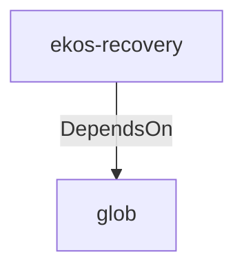

# glob (Technology)

## Properties

_No compiled properties._

## Relationships

### DependsOn

- ← ekos-recovery (`28244ebb-4e16-5e8d-a637-5e750d01f2b8`) — evidence: ekos-recovery depends on glob 0.3

## Diagram

## Evidence

- `140396ed-0ebc-4233-a166-85dc30b16322` — ekos-recovery depends on glob 0.3 (confidence: 1.00)
