# hex (Technology)

## Properties

_No compiled properties._

## Relationships

### DependsOn

- ← ekos-compiler-core (`2690bc0d-0233-516f-b969-9e87432f623d`) — evidence: ekos-compiler-core depends on hex 0.4
- ← ekos-observation-sdk (`9a955a3a-55bc-587a-942d-fb81d6260052`) — evidence: ekos-observation-sdk depends on hex 0.4
- ← ekos-artifact (`8806bf54-6364-5052-b85a-cef4344e8f19`) — evidence: ekos-artifact depends on hex 0.4
- ← ekos-common (`dc169f0a-98f1-5c7c-8dd0-1dbc8504e9c9`) — evidence: ekos-common depends on hex 0.4
- ← ekos-recovery (`28244ebb-4e16-5e8d-a637-5e750d01f2b8`) — evidence: ekos-recovery depends on hex 0.4
- ← ekos-ledger (`9c977335-c421-519c-a889-558f0487574e`) — evidence: ekos-ledger depends on hex 0.4
- ← ekos-plugin-localdocs (`0659fbf3-d2f4-54ba-835f-a7f6f875a7d1`) — evidence: ekos-plugin-localdocs depends on hex 0.4
- ← ekos-plugin-pentaho (`dac1d743-a50e-57a9-8acb-56e29a47ef5e`) — evidence: ekos-plugin-pentaho depends on hex 0.4
- ← ekos-plugin-file (`06b65958-abb7-5fe1-a6ee-d35946d39062`) — evidence: ekos-plugin-file depends on hex 0.4
- ← ekos-plugin-python (`020c78ca-f337-542f-b351-8b4201393bbb`) — evidence: ekos-plugin-python depends on hex 0.4
- ← ekos-plugin-rust (`07179bab-d486-5b14-8c68-6e743e45b3f6`) — evidence: ekos-plugin-rust depends on hex 0.4

## Diagram

```mermaid
graph TD
    nfa78580631c35308ae4a2898a2c181ca["hex"]
    n2690bc0d0233516fb9699e87432f623d["ekos-compiler-core"]
    n2690bc0d0233516fb9699e87432f623d -->|DependsOn| nfa78580631c35308ae4a2898a2c181ca
    n9a955a3a55bc587a942dfb81d6260052["ekos-observation-sdk"]
    n9a955a3a55bc587a942dfb81d6260052 -->|DependsOn| nfa78580631c35308ae4a2898a2c181ca
    n8806bf5463645052b85acef4344e8f19["ekos-artifact"]
    n8806bf5463645052b85acef4344e8f19 -->|DependsOn| nfa78580631c35308ae4a2898a2c181ca
    ndc169f0a98f15c7c8dd01dbc8504e9c9["ekos-common"]
    ndc169f0a98f15c7c8dd01dbc8504e9c9 -->|DependsOn| nfa78580631c35308ae4a2898a2c181ca
    n28244ebb4e165e8da6375e750d01f2b8["ekos-recovery"]
    n28244ebb4e165e8da6375e750d01f2b8 -->|DependsOn| nfa78580631c35308ae4a2898a2c181ca
    n9c977335c421519ca889558f0487574e["ekos-ledger"]
    n9c977335c421519ca889558f0487574e -->|DependsOn| nfa78580631c35308ae4a2898a2c181ca
    n0659fbf3d2f454ba835fa7f6f875a7d1["ekos-plugin-localdocs"]
    n0659fbf3d2f454ba835fa7f6f875a7d1 -->|DependsOn| nfa78580631c35308ae4a2898a2c181ca
    ndac1d743a50e57a98acb56e29a47ef5e["ekos-plugin-pentaho"]
    ndac1d743a50e57a98acb56e29a47ef5e -->|DependsOn| nfa78580631c35308ae4a2898a2c181ca
    n06b65958abb75fe1a6eed35946d39062["ekos-plugin-file"]
    n06b65958abb75fe1a6eed35946d39062 -->|DependsOn| nfa78580631c35308ae4a2898a2c181ca
    n020c78caf337542fb3518b4201393bbb["ekos-plugin-python"]
    n020c78caf337542fb3518b4201393bbb -->|DependsOn| nfa78580631c35308ae4a2898a2c181ca
    n07179babd4865b148c686e743e45b3f6["ekos-plugin-rust"]
    n07179babd4865b148c686e743e45b3f6 -->|DependsOn| nfa78580631c35308ae4a2898a2c181ca
```

## Evidence

- `0fdba293-6a6d-4842-8708-ca820355e2f4` — ekos-compiler-core depends on hex 0.4 (confidence: 1.00)
- `696bab7b-dad5-4afa-abb4-9b31e5ec0afb` — ekos-observation-sdk depends on hex 0.4 (confidence: 1.00)
- `7e0b7b23-8565-407a-8661-d467987b89a7` — ekos-artifact depends on hex 0.4 (confidence: 1.00)
- `d81a3836-dd6b-4256-920f-1dabe6c3978a` — ekos-common depends on hex 0.4 (confidence: 1.00)
- `c60c556e-38a4-4f8d-86ab-de99ff131661` — ekos-recovery depends on hex 0.4 (confidence: 1.00)
- `8a5e8ac1-e2c3-450d-99af-90e2940a21da` — ekos-ledger depends on hex 0.4 (confidence: 1.00)
- `c73c6b03-335f-4059-ad77-a15aad068743` — ekos-plugin-localdocs depends on hex 0.4 (confidence: 1.00)
- `7b20b361-25c5-4c87-ac42-5cdac8b49586` — ekos-plugin-pentaho depends on hex 0.4 (confidence: 1.00)
- `56be91ee-e9a0-4f16-8c9d-32c922dfe9a4` — ekos-plugin-file depends on hex 0.4 (confidence: 1.00)
- `6f9c47ab-379c-488b-b4cd-d48ecadf0104` — ekos-plugin-python depends on hex 0.4 (confidence: 1.00)
- `8168b1f5-9f51-42cd-96af-3ee9db1272a0` — ekos-plugin-rust depends on hex 0.4 (confidence: 1.00)
