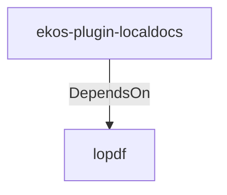

# lopdf (Technology)

## Properties

_No compiled properties._

## Relationships

### DependsOn

- ← ekos-plugin-localdocs (`0659fbf3-d2f4-54ba-835f-a7f6f875a7d1`) — evidence: ekos-plugin-localdocs depends on lopdf 0.44

## Diagram

## Evidence

- `85085573-10de-46f3-8559-6226792ee481` — ekos-plugin-localdocs depends on lopdf 0.44 (confidence: 1.00)
