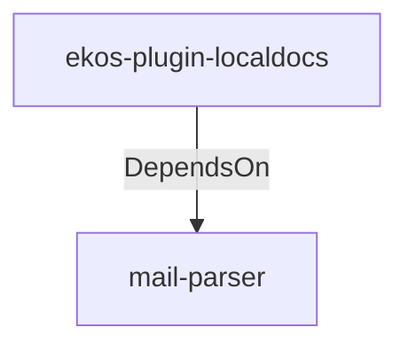

# mail-parser (Technology)

## Properties

_No compiled properties._

## Relationships

### DependsOn

- ← ekos-plugin-localdocs (`0659fbf3-d2f4-54ba-835f-a7f6f875a7d1`) — evidence: ekos-plugin-localdocs depends on mail-parser 0.11

## Diagram

## Evidence

- `d256cffb-54ce-427a-84f8-af6d7508bebb` — ekos-plugin-localdocs depends on mail-parser 0.11 (confidence: 1.00)
