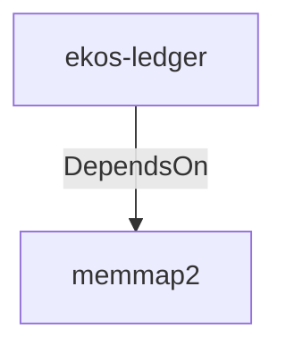

# memmap2 (Technology)

## Properties

_No compiled properties._

## Relationships

### DependsOn

- ← ekos-ledger (`9c977335-c421-519c-a889-558f0487574e`) — evidence: ekos-ledger depends on memmap2 0.9

## Diagram

## Evidence

- `a8755c43-6390-4b6f-a5d1-27f9c2603ea7` — ekos-ledger depends on memmap2 0.9 (confidence: 1.00)
